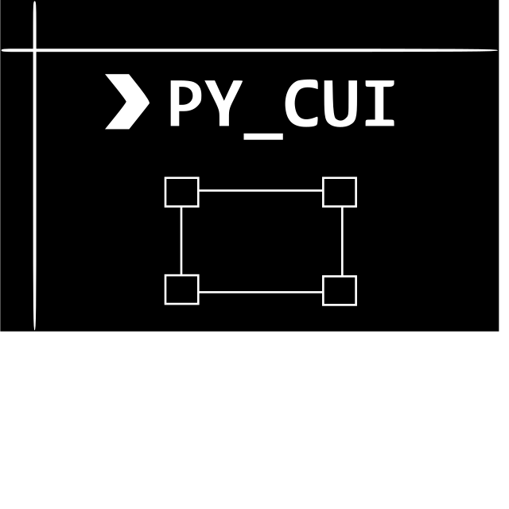

<div align="center">
    
</div>

<div align="center">
    <p><strong><br/>A library for creating CUI/TUI interfaces with pre-built widgets in python.</strong></p>
    <p>Easily build text-based user interfaces on both Linux and Windows.</p>
    <a href="#">
        
    </a>
    <a href="https://pepy.tech/project/py-cui">
        
    </a>
    <a href="https://badge.fury.io/py/py-cui">
        
    </a>
    <a href="#">
        
    </a>
</div>

---

# py_cui

`py_cui` is a python library meant to simplify writing command line user interfaces in python. It relies on `curses` for terminal rendering, which is traditionally a unix-specific, however, you may use the [windows-curses](https://github.com/zephyrproject-rtos/windows-curses) module to run `py_cui` on windows.

The main advantage `py_cui` has over typical text-based user interface builders is that it relies on widgets and a grid layout manager like most traditional graphical user interfaces. You may define a grid size, and then drop predefined widgets onto it into specific grid locations. Widgets can also be stretched accross multiple grid rows and columns. If you've ever made a Tkinter GUI, you will feel right at home.

If you would like to contribute, feel free to make an issue or pull request after reading through the `CONTRIBUTING.md` file.

## Installation

You may install `py_cui` via pip (use `pip3` if python 2 and 3 are installed side by side)
```
pip install py-cui
```
Make sure to run as root/sudo as required. Note that the library is titled `py_cui`, but the name of the pypi package is `py-cui`, though in most cases, installing with 
```
pip install py_cui
```
should work OK.

If you would like to use `py_cui` directly from source, clone this repository with:
```
git clone https://github.com/jwlodek/py_cui
```
Then build/install with `pip`:
```
cd py_cui
pip install .
```
If you would like to try it out without installing, first make sure that `curses` is installed (`windows-curses` if on windows), and then copy one of the example files into the top directory. You may then simply run it with `python3`.

## Examples

Below are some screenshots and gifs of programs written with py_cui. Additional (simpler) examples are available in the `examples/` directory of this repository.

**py_cui_2048 - A command line version of the classic 2048 game**

[py_cui_2048](https://github.com/jwlodek/py_cui_2048) is a demo of using `py_cui` to build simple CUI games and applications. The entire game was made in under 400 lines of code.
<p align="center">
    
</p>

**recoverpy - A TUI that allows for recovering lost or deleted files**

[recoverpy](https://github.com/PabloLec/recoverpy) is a utility for recovering files on linux. It will search through every inode to find your requested file block.

<p align="center">
    
</p>

**pyautogit - A command line interface for managing git repositories**

[pyautogit](https://github.com/jwlodek/pyautogit) is the first larger scale project written in `py_cui`. Feel free to use it as a guide to programming with `py_cui`.
<p align="center">
    
</p>

## Getting started

The easiest way to get set up for developing a full `py_cui` application is to use the available `cookiecutter` template. First, install the `cookiecutter` tool:
```
pip install cookiecutter
```
Once it is installed, navigate to the directory in which you would like your projects to live, and run:
```
cookiecutter https://github.com/jwlodek/py_cui_cookiecutter
```
This will clone the template, and show prompts for several variables, including project name and description, as well as some developer information.
Once it is done, you can enter your project directory, install it with pip, and run it, and you should be able to see a `Hello World` example:
```
cd myproject
pip install .
myproject
```
You are now ready to extend this template for your own application!

## Writing a PyCUI

Basic usage of `py_cui` starts with creating a PyCUI object, and specifiying it's grid size. Keep in mind that grid cell height and width will be measured in terminal characters, not pixels, so there is a lower limit on legal grid size, and heights will be smaller values than widths. Create this object with:
```
root = py_cui.PyCUI(7, 9)
```
The above line will create a UI with 7 rows and 9 columns. Then, add widgets with the different add commands:
```
label = root.add_label('Label Text', 0, 0)
button = root.add_button('Button Text', 1, 2, column_span=2, command=my_function)
...
```

Finally, start the CUI with
```
root.start()
```

`py_cui` has support for custom key bindings for both the overview mode and focused mode, popup windows and prompts, color rendering rules, and several useful widgets. For more details on writing `py_cui` based interfaces, be sure to check on the examples and the documentation [here](https://jwlodek.github.io/py_cui-docs).

## Using a PyCUI

There are some basic rules that apply to all `py_cui` based interfaces. There are three key operating modes - overview mode, focus mode, and popup mode. 

**Overview Mode**

Overview mode is the main control view of the interface. In this mode you use the arrow keys to move between widgets, and you may select widgets with the `Enter` key. By default, you may also press buttons in this mode, unless `auto_focus_buttons` is set to false when the CUI was created.

**Focus Mode**

When in focus mode, you enter into a particular widget (For example a text box.). Each widget has some predefined basic controls, such as arrow keys to scroll in a `ScrollMenu`. You may also add keybindings to functions for each particular widget. These keybindings will only apply to a widget if it is in focus mode. Enter focus mode by navigating to a widget in overview mode and hitting the `Enter` key. Return to overview mode from focus mode by pressing `Escape`.

**Popup Mode**

Popup mode simply displays a popup over the rest of the UI. Each popup type behaves slightly differently. For example, you may exit an info popup mode by pressing `Space`, `Enter`, or `Escape`, while a loading popup will remain onscreen until whatever operation is being run is terminated.

## Unit Tests

`py_cui` unit tests are written for `pytest`. Make sure `pytest` is installed, and simply run
```
pytest
```
in the root directory to run all unit tests.

## Powered by py_cui

Below is a table of python projects developed with the help of `py_cui`. If you've made something, feel free to make a pull request to add it!

Project | Description
--------|-------------
[pypodcasts](https://github.com/jwlodek/pypodcasts) | A TUI for listening to and managing podcast feeds. (Coming Soon)
[pyautogit](https://github.com/jwlodek/pyautogit) | A command line UI for interfacing with git features for multiple repositories.
[recoverpy](https://github.com/PabloLec/recoverpy) | A CUI for recovering overwritten or deleted data on linux.
[py_cui_2048](https://github.com/jwlodek/py_cui_2048) | A CUI version of the classic 2048 game.
[unipkg](https://github.com/jwlodek/unipkg) | A CUI interface for managing all installed package managers on your system. (In-Progress)
[CUIAudioPlayer](https://github.com/jupiterbjy/CUIAudioPlayer) | A TUI for playing back audio files in a variety of formats.
[tinypub](https://github.com/HakierGrzonzo/tinyPub) | A console-based ebook reader.
[hue-tui](https://github.com/channel-42/hue-tui) | A CUI controlling for Philips Hue lights.
[mini-radio-player](https://github.com/wdog/mini-radio-player-pycui) | A terminal based radio interface for linux.

## License

BSD 3-Clause License

Copyright (c) 2019-2020, Jakub Wlodek
