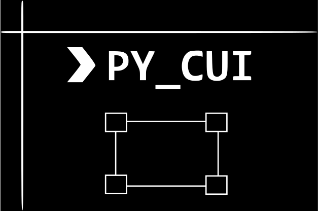

    

    
<strong> A library for creating CUI/TUI interfaces with pre-built widgets in python.</strong>

    
Easily build text-based user interfaces on both Linux and Windows.

    
    
    
    

---

# py_cui

`py_cui` is a python library meant to simplify writing command line user interfaces in python. It is built upon the `curses` module, which is traditionally a unix-specific, however, you may use [windows-curses](https://github.com/zephyrproject-rtos/windows-curses) to gain compatibility for `py_cui` on windows.

The main advantage `py_cui` has over typical text-based user interface builders is that it relies on widgets and a grid layout manager like most traditional graphical user interfaces. You may define a grid size, and then drop predefined widgets onto it into specific grid locations. Widgets can also be stretched accross multiple grid rows and columns. If you've ever made a Tkinter GUI, you will feel right at home.

## Examples

Below are some screenshots/gifs of programs written with py_cui. Additional (simpler) examples are available in the `examples/` directory of this repository.

**py_cui_2048 - A command line version of the classic 2048 game**

[py_cui_2048](https://github.com/jwlodek/py_cui_2048) is a demo of using `py_cui` to build simple CUI games and applications. The entire game was made in under 400 lines of code.

    

**unipkg - A command line utility that will allow for managing all installed package managers on your system through one cli interface**

[unipkg](https://github.com/jwlodek/unipkg) is currently an in-progress project, check back in the future to see a screenshot, and more information.

**pyautogit - A command line interface for managing git repositories**

[pyautogit](https://github.com/jwlodek/pyautogit) is the first larger scale project written in `py_cui`. Feel free to use it as a guide to programming with `py_cui`.

    

## Powered by py_cui

Below is a table of python projects developed with the help of `py_cui`. If you've made something, feel free to make a pull request to add it!

Project | Description
--------|-------------
[pyautogit](https://github.com/jwlodek/pyautogit) | A command line UI for interfacing with git features for multiple repositories.
[py_cui_2048](https://github.com/jwlodek/py_cui_2048) | A CUI version of the classic 2048 game.
[unipkg](https://github.com/jwlodek/unipkg) | A CUI interface for managing all installed package managers on your system. (In-Progress)
[tinypub](https://github.com/HakierGrzonzo/tinyPub) | A console-based ebook reader.
[hue-tui](https://github.com/channel-42/hue-tui) | A CUI controlling for Philips Hue lights.

## License

BSD 3-Clause License

Copyright (c) 2019-2020, Jakub Wlodek